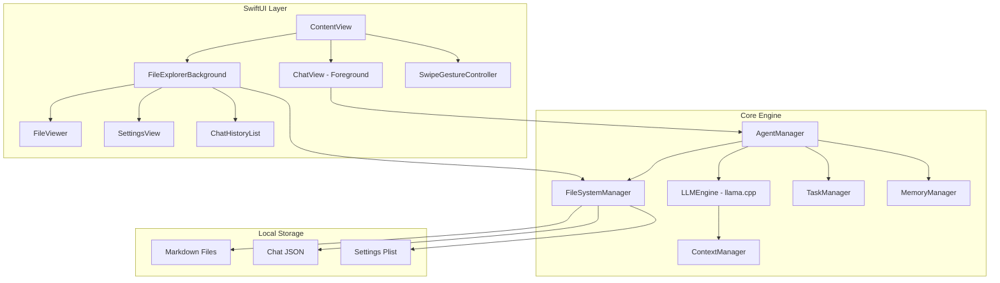

# EliAI — Local iOS Personal AI

A fully local, privacy-first iOS personal AI app powered by on-device **HY-1.8B-2Bit** inference via llama.cpp. Features an agentic system that can create/manage files (memory, tasks, reminders) and a unique translucent file-explorer UI with swipe-based navigation.

## User Review Required

> [!IMPORTANT]
> **Model Choice**: The app will use the **HY-1.8B-2Bit-GGUF** model (quantized HunYuan 1.8B). This model is optimized for edge devices, requiring only ~600MB of storage and offering better performance than the 0.5B model while remaining efficient enough for the iPhone 15. The app will download this specific model.

> [!IMPORTANT]
> **Distribution Method**: Since you're on Windows (no Xcode), the best approach is:
> 1. Create the **complete Swift/SwiftUI project** with all source files, configs, and build scripts
> 2. You'll need a Mac (even a virtual Mac or CI service like GitHub Actions with macOS runners) to compile the IPA
> 3. The project will be structured as a standard Xcode project that builds with `xcodebuild` — then sideload via AltStore
> 
> I'll create every source file, the Xcode project structure, and a build script. You just need to run `./build.sh` on a Mac.

> [!WARNING]
> **On-device inference speed**: The HY-1.8B-2Bit model is highly efficient, but running on a phone still requires managing resources carefully. The 2-bit quantization helps significantly with memory bandwidth and storage.

---

## Architecture Overview



---

## Proposed Changes

### Project Structure

```
EliAI/
├── EliAI.xcodeproj/                    # Xcode project (generated)
├── Package.swift                        # SPM for llama.cpp XCFramework
├── build.sh                             # Build script for IPA
├── EliAI/
│   ├── EliAIApp.swift                   # App entry point
│   ├── Info.plist                       # iOS app config
│   ├── Assets.xcassets/                 # App icons, colors
│   │
│   ├── Core/
│   │   ├── LLMEngine.swift              # llama.cpp wrapper
│   │   ├── AgentManager.swift           # Agentic tool execution
│   │   ├── FileSystemManager.swift      # File CRUD operations
│   │   ├── MemoryManager.swift          # Persistent memory/notes
│   │   ├── TaskManager.swift            # Tasks & reminders
│   │   ├── ChatManager.swift            # Chat history CRUD
│   │   └── ModelDownloader.swift        # HuggingFace model download
│   │
│   ├── Models/
│   │   ├── ChatMessage.swift            # Message data model
│   │   ├── ChatSession.swift            # Session data model
│   │   ├── AgentTool.swift              # Tool definitions
│   │   ├── FileItem.swift               # File tree model
│   │   └── AppSettings.swift            # Settings model
│   │
│   ├── Views/
│   │   ├── ContentView.swift            # Root view with gesture layer
│   │   ├── ChatView.swift               # Chat interface
│   │   ├── MessageBubble.swift          # Individual message view
│   │   ├── FileExplorerView.swift       # Background file browser
│   │   ├── FileDetailView.swift         # Markdown file viewer
│   │   ├── SettingsView.swift           # Settings page
│   │   ├── ChatListView.swift           # Past chats list
│   │   ├── ModelManagerView.swift       # Model download/select
│   │   └── NewChatDialog.swift          # Long-press naming dialog
│   │
│   └── Utilities/
│       ├── MarkdownParser.swift         # Markdown rendering
│       └── HapticFeedback.swift         # Haptic feedback
│
└── README.md
```

---

### Core Engine

#### [NEW] [LLMEngine.swift](file:///c:/Users/eliam/Downloads/ai%20code/EliAI/EliAI/Core/LLMEngine.swift)

The heart of the app. Wraps llama.cpp's C API via the XCFramework:

- **Model loading**: Loads `.gguf` model from the app's documents directory
- **Streaming generation**: Token-by-token output via `AsyncStream<String>`
- **Context management**: Maintains conversation context with KV-cache
- **System prompt**: Injects agentic system prompt with tool definitions
- **Metal acceleration**: Uses Apple GPU via llama.cpp's Metal backend (automatic with XCFramework)

Key design:
```swift
@Observable
class LLMEngine {
    var isLoaded = false
    var isGenerating = false
    
    func loadModel(at path: URL) async throws
    func generate(prompt: String, maxTokens: Int) -> AsyncStream<String>
    func resetContext()
}
```

#### [NEW] [AgentManager.swift](file:///c:/Users/eliam/Downloads/ai%20code/EliAI/EliAI/Core/AgentManager.swift)

Parses LLM output for tool calls and executes them:

- **Tool definitions**: `create_file`, `edit_file`, `read_file`, `list_files`, `create_memory`, `create_task`, `set_reminder`
- **Output parser**: Detects `<tool_call>` blocks in LLM output
- **Execution loop**: Run tool → inject result → continue generation
- **Safety**: All operations sandboxed to app's document directory

#### [NEW] [FileSystemManager.swift](file:///c:/Users/eliam/Downloads/ai%20code/EliAI/EliAI/Core/FileSystemManager.swift)

Manages the app's local file system:

- **CRUD**: Create, read, update, delete markdown files
- **Directory tree**: Recursive directory listing for the file explorer
- **Chat persistence**: Save/load chat sessions as JSON
- **Predefined structure**: `memory/`, `tasks/`, `chats/`, `notes/` directories

#### [NEW] [ModelDownloader.swift](file:///c:/Users/eliam/Downloads/ai%20code/EliAI/EliAI/Core/ModelDownloader.swift)

Downloads GGUF models from HuggingFace:

- **Progress tracking**: Real-time download progress with `URLSession`
- **Resume support**: Supports resumed downloads
- **Integrity check**: File size verification after download
- **Sources**:
  - `HY-1.8B-2Bit-GGUF` (~600MB) from [AngelSlim/HY-1.8B-2Bit-GGUF](https://huggingface.co/AngelSlim/HY-1.8B-2Bit-GGUF)

---

### UI Layer

#### [NEW] [ContentView.swift](file:///c:/Users/eliam/Downloads/ai%20code/EliAI/EliAI/Views/ContentView.swift)

The root view managing the layered UI architecture:

```
┌─────────────────────────────┐
│  FileExplorerView           │  ← Background layer (translucent)
│  (files, settings, chats)   │
│                             │
│  ┌───────────────────────┐  │
│  │     ChatView           │  │  ← Foreground layer (swipe up)
│  │     (messages + input) │  │
│  │                       │  │
│  └───────────────────────┘  │
└─────────────────────────────┘
```

- **Default state**: White screen, file explorer visible as translucent background
- **Swipe up**: Chat slides up, covering background; file explorer fades away
- **Swipe down**: Chat slides down, file explorer returns (translucent)
- **Tap on file explorer**: Temporarily becomes opaque for interaction
- **Tap away / swipe up**: Returns to translucent

#### [NEW] [ChatView.swift](file:///c:/Users/eliam/Downloads/ai%20code/EliAI/EliAI/Views/ChatView.swift)

Chat interface with:
- Scrollable message list with streaming token display
- Text input bar with send button
- Typing indicator during generation
- Tool execution status indicators (when agent performs actions)

#### [NEW] [FileExplorerView.swift](file:///c:/Users/eliam/Downloads/ai%20code/EliAI/EliAI/Views/FileExplorerView.swift)

Background file system browser:
- Tree view of all markdown files organized by directory
- Past chat sessions listed
- Settings access
- "New Chat" button (long-press for naming dialog)
- Translucent by default (0.3 opacity), opaque (1.0) when interacted

#### [NEW] [FileDetailView.swift](file:///c:/Users/eliam/Downloads/ai%20code/EliAI/EliAI/Views/FileDetailView.swift)

Markdown file viewer/editor:
- Renders markdown content
- Edit mode for manual edits
- Shows file metadata (created/modified dates)

---

### Data Models

#### [NEW] [ChatMessage.swift](file:///c:/Users/eliam/Downloads/ai%20code/EliAI/EliAI/Models/ChatMessage.swift)

```swift
struct ChatMessage: Identifiable, Codable {
    let id: UUID
    let role: Role        // .user, .assistant, .system, .tool
    var content: String
    let timestamp: Date
    var toolCalls: [ToolCall]?
    
    enum Role: String, Codable { case user, assistant, system, tool }
}
```

#### [NEW] [AgentTool.swift](file:///c:/Users/eliam/Downloads/ai%20code/EliAI/EliAI/Models/AgentTool.swift)

Tool definitions the LLM can invoke:

| Tool | Description |
|------|-------------|
| `create_file(path, content)` | Create a new markdown file |
| `edit_file(path, content)` | Overwrite file content |
| `read_file(path)` | Read file content |
| `list_files(directory)` | List directory contents |
| `create_memory(title, content)` | Save a memory note |
| `create_task(title, due, details)` | Create a task/reminder |
| `search_files(query)` | Search across all files |

---

### Build & Distribution

#### [NEW] [build.sh](file:///c:/Users/eliam/Downloads/ai%20code/EliAI/build.sh)

Shell script to build the IPA on macOS:

```bash
#!/bin/bash
# Build EliAI.ipa for sideloading via AltStore
xcodebuild archive \
    -project EliAI.xcodeproj \
    -scheme EliAI \
    -archivePath build/EliAI.xcarchive \
    -sdk iphoneos \
    -configuration Release

# Export IPA
xcodebuild -exportArchive \
    -archivePath build/EliAI.xcarchive \
    -exportPath build/ \
    -exportOptionsPlist ExportOptions.plist
```

#### [NEW] [ExportOptions.plist](file:///c:/Users/eliam/Downloads/ai%20code/EliAI/ExportOptions.plist)

Export configuration for AltStore sideloading (development signing).

---

## Verification Plan

### Build Verification
- Run `xcodebuild build` on macOS to verify compilation
- Verify llama.cpp XCFramework links correctly
- Check all Swift files have no compilation errors

### Functional Testing
- Test model download from HuggingFace
- Test model loading and inference with HY-1.8B-2Bit
- Test file creation/reading via agent tools
- Test chat history save/load

### UI Testing
- Verify swipe gestures between chat and file explorer
- Test translucent ↔ opaque transitions on file explorer
- Test new chat creation with long-press naming
- Test markdown file viewing

### Manual Verification
- Build IPA and sideload via AltStore on iPhone 15
- Test full conversation flow with local inference
- Verify all files created by the agent are accessible in file explorer
